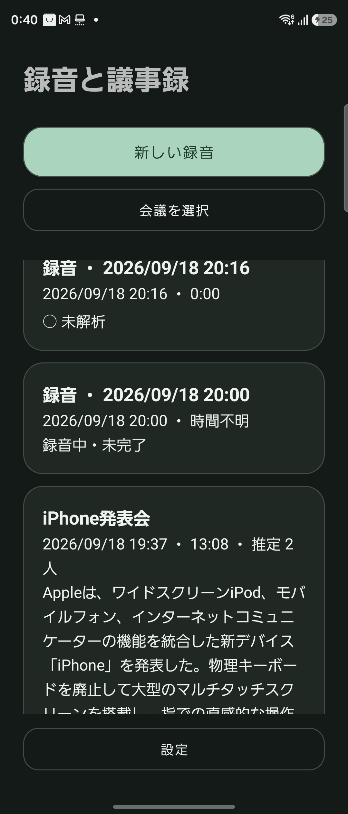
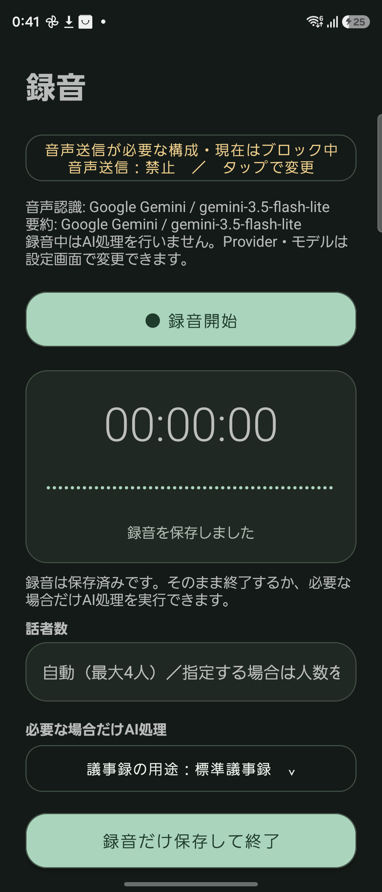
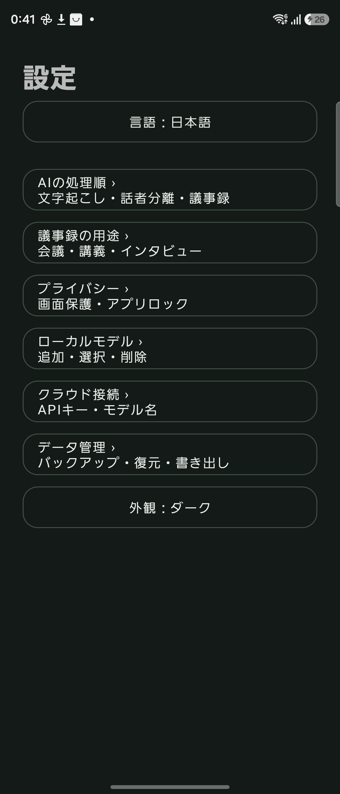
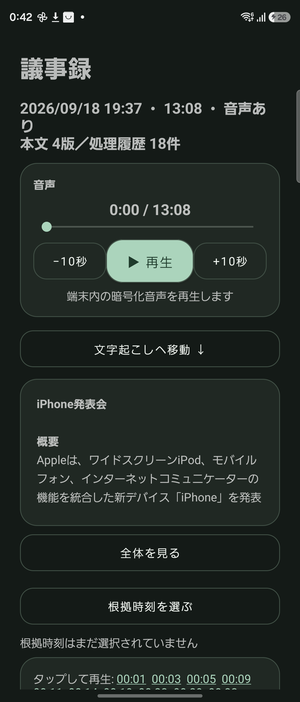

# mint AI レコーダー 操作説明書

mint AI レコーダーは、Android端末で会議を録音し、文字起こし、話者分離、テキスト整形、議事録作成、再生、編集、書き出しを行うアプリです。

録音と会議データは端末内へ暗号化して保存します。AI処理は必要な場合だけ実行でき、工程ごとにローカルAI、OpenAI、Google Geminiを選択できます。

> [!IMPORTANT]
> 本ソフトウェアの独自制作部分はApache License 2.0で提供します。利用、改変、再配布はライセンス条件に従って可能です。第三者コンポーネントには、それぞれのライセンスが適用されます。

## 画面イメージ

| 会議一覧 | 録音画面 | 設定画面 |
| --- | --- | --- |
|  |  |  |

## 1. 対応端末

| 項目 | 要件 |
| --- | --- |
| Android | Android 8.0以上（API 26以上） |
| CPU | 64-bit ARM（`arm64-v8a`） |
| 録音 | マイク権限が必要 |
| ローカルAI | モデルに応じた空き容量とメモリが必要 |

軽量Whisper、高精度Whisper、話者分離、Qwen3-4Bを同時に使う場合は、RAM 12GB級、空き容量8GB以上が目安です。

## 2. インストール

1. GitHub Releasesから公式の`mint-ai-recorder-バージョン.apk`と`SHA256SUMS.txt`をダウンロードします。
2. 必要に応じてAPKのSHA-256が`SHA256SUMS.txt`と一致することを確認します。
3. AndroidでAPKを開きます。
4. Androidから確認された場合は、ダウンロードに使用したアプリに限って「不明なアプリのインストール」を許可します。
5. 「インストール」を押します。

更新時も同じ配布元の公式APKを使用してください。公式APKは同じリリース鍵で署名されます。別の鍵で署名された改変APKは、公式版の上へ更新インストールできません。

## 3. 初回起動

1. mint AI レコーダーを起動します。
2. アプリロック画面が表示された場合は、端末の生体認証、PIN、パターン、またはパスワードで解除します。
3. 録音開始時にマイク権限を許可します。
4. 通知権限を求められた場合は許可します。録音状態の表示と停止操作に使用します。

録音だけを利用する場合、AIモデル、APIキー、ネットワーク接続は必要ありません。

## 4. 基本的な使い方

1. 会議一覧で「新しい録音」を押します。
2. 録音画面で「録音開始」を押します。
3. 必要に応じて「一時停止」「録音再開」を使います。
4. 終了時に「停止して保存」を押します。
5. 録音だけを残す場合は「録音だけ保存して終了」を押します。
6. 議事録が必要な場合は「AIで文字起こし・議事録を作成」を押します。
7. 処理後に「再生・詳細を開く」を押します。

録音がない、録音中である、またはAI処理中であるなど、実行条件を満たしていないボタンは薄い色で表示され、押すことができません。

## 5. 会議一覧

会議一覧には、保存日時、録音時間、解析状態、議事録タイトルが表示されます。

- **新しい録音**: 録音画面を開きます。
- **会議をタップ**: 再生・議事録詳細画面を開きます。
- **会議を選択**: 複数の会議を選んで削除します。
- **設定**: AI、モデル、言語、外観、セキュリティ、バックアップを変更します。

会議の削除は取り消せません。必要な会議は先に暗号化バックアップを作成してください。

## 6. 録音画面

### 録音する

1. 「録音開始」を押します。
2. 経過時間と入力音量を確認します。
3. 中断する場合は「一時停止」を押します。
4. 続ける場合は「録音再開」を押します。
5. 終了時は「停止して保存」を押します。

録音中に画面を閉じても、Androidの録音サービスは継続します。通知から一時停止、再開、停止を操作できます。

### 話者数を指定する

話者数が空欄の場合は自動判定します。参加人数が分かっている場合は数値を入力すると、話者分離が安定しやすくなります。

### AI処理の順番

「AIで文字起こし・議事録を作成」を押すと、次の順番で処理します。

1. 音声認識
2. 端末内での話者分離
3. テキスト整形
4. 議事録作成

処理結果は最初の一部分だけ表示されます。「全体を見る」で全文を表示し、「折りたたむ」で短い表示に戻します。

## 7. ローカルAIとクラウドAI

| 項目 | ローカルAI | OpenAI / Gemini |
| --- | --- | --- |
| データ送信 | 録音や本文を端末外へ送信しない | 選択した処理に必要なデータを送信する |
| 初期設定 | モデルの導入が必要 | APIキーとモデル名が必要 |
| 処理性能 | 端末性能に依存 | ネットワークとProviderに依存 |
| 長時間録音 | 処理時間、メモリ、電池消費が増える | 利用料金と送信量が増える場合がある |

クラウド音声認識では録音音声、クラウドでの整形・議事録作成では文字起こし本文が送信対象です。アプリはProviderを自動で切り替えません。

外部に送信したくない情報がある場合は、すべての工程でローカルAIを選択してください。

## 8. ローカルモデル

設定の「ローカルモデル」から次の操作ができます。

- 推奨モデルを導入
- ファイルまたはHTTPS URLから追加
- 導入済みモデルの選択、再検証、削除

軽量Whisperは速度と容量を優先します。高精度モデルは認識品質が上がる一方、処理時間、メモリ、保存容量が増えます。話者分離を使う場合はCAM++モデルも導入します。

導入したモデルが一覧に表示されない場合は、「導入済み推奨モデルを再検証」を実行してから、音声認識モデルの選択画面を開き直してください。

## 9. 議事録詳細画面

### 録音を再生する

- 再生、一時停止、10秒戻し、10秒送りを利用できます。
- スライダーを動かすと任意の位置へ移動できます。
- 文字起こし内の時刻をタップすると、その発話位置から再生します。
- タイムスタンプを選ぶと文字起こしが展開され、該当位置へ移動します。

### 文字起こしを編集する

1. 「編集する」を押します。
2. 本文を修正します。
3. 「編集を保存」を押します。

編集内容は新しい版として保存されます。「版を比較」から以前の版との差分確認と復元ができます。

### 全文を表示する

議事録と文字起こしは初期状態では折りたたまれ、一部分だけ表示されます。「全体を見る」で全文を開き、「折りたたむ」で元に戻します。

## 10. 設定

### 言語

「日本語 / English」から表示言語を切り替えます。英語を選ぶと、対応するAIプロンプトも英語になります。

### AIの処理順

文字起こし、テキスト整形、議事録作成について、ローカル、OpenAI、GeminiのProviderとモデルを個別に選択します。変更後は「AI設定を保存」を押します。

### プライバシー

- **アプリロック**: 5分以上バックグラウンドになった後に再認証します。
- **スクリーンショット保護**: 初期状態では撮影を禁止します。
- **音声外部送信保護**: 初期状態ではクラウドへの音声送信を禁止します。

### 外観

ライト、ダーク、端末設定に合わせる、から選択できます。

## 11. ホーム画面ウィジェット

1. Androidのホーム画面を長押しします。
2. 「ウィジェット」を開きます。
3. mint AI レコーダーのウィジェットを追加します。

- 待機中: 録音開始、直近の保存済み録音へのAI処理
- 録音中: 一時停止、停止して保存
- 一時停止中: 録音再開、停止して保存
- AI処理中: 誤操作防止のため状態変更ボタンを無効化

録音していないときは、ウィジェットの録音時間が進み続けないよう録音状態と同期します。

## 12. 書き出し

- **議事録を書き出す**: MarkdownまたはPDFで保存します。
- **録音音声を書き出す**: WAV形式で保存します。

書き出したファイルは、アプリ内の暗号化保護と削除機能の対象外です。保存先、共有先、クラウド同期の設定を確認してください。

## 13. バックアップと復元

設定の「データ管理」から暗号化バックアップを作成できます。

1. バックアップする会議を選びます。
2. 保存先を選びます。
3. 強いパスフレーズを設定します。
4. 回復キーを利用する場合は、別の安全な場所へ保存します。

パスフレーズと回復キーの両方を失うと、開発者を含め誰も復元できません。APIキーと声紋データはバックアップに含まれません。

## 14. 削除

### 会議全体を削除

録音、文字起こし、話者ラベル、議事録、編集履歴、暗号鍵を削除します。復元できません。

### 音声だけ削除

文字起こし、議事録、編集履歴は残ります。音声の再生、再文字起こし、再話者分離はできなくなります。

## 15. 困ったとき

### 録音開始を押せない

- AI処理が完了するまで待ちます。
- マイク権限を確認します。
- 既に録音中または一時停止中でないか確認します。

### AI処理を開始できない

- 録音を停止して保存します。
- 選択したローカルモデルが導入済みか確認します。
- クラウド利用時はAPIキー、モデル名、ネットワーク接続を確認します。
- クラウド音声認識の場合は音声外部送信保護を確認します。

### タイムスタンプから再生できない

- 会議詳細を閉じて、もう一度開きます。
- 音声データが削除されていないか確認します。
- 古い解析結果の場合は「録音を再解析」を実行します。

### 後半が`SPEAKER_UNKNOWN`になる

- 話者分離モデルが導入済みか確認します。
- 分かる場合は録音画面で話者数を指定します。
- 古い解析結果の場合は更新版アプリで再解析します。

### PDFやWAVを見失った

書き出し時に選択したAndroidの保存先を確認します。アプリは外部保存先のファイルを自動管理しません。

## 16. セキュリティ

- 録音、文字起こし、議事録、編集履歴は会議ごとの鍵でAES-256-GCM暗号化します。
- 録音音声と本文の鍵は分離されています。
- APIキーはAndroid Keystore由来の鍵で暗号化して保存します。
- OSのクラウドバックアップと端末間自動転送は無効です。
- HTTP平文通信は無効です。
- テレメトリー、広告SDK、独自クラウド同期は実装していません。
- 会議を削除すると暗号鍵も破棄され、元に戻せません。

## 17. 利用条件

本ソフトウェアの独自制作部分は[Apache License 2.0](LICENSE)で提供します。利用、改変、再配布を行う場合は、同ライセンスの条件に従ってください。第三者ライブラリ、モデル、素材には、それぞれの権利者が定めるライセンスが適用されます。

Copyright © 2026 mint AI Recorder contributors.
